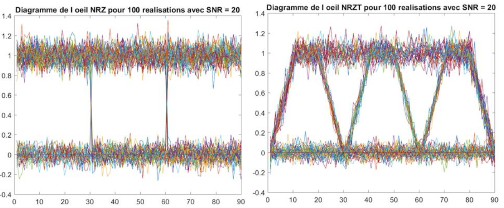
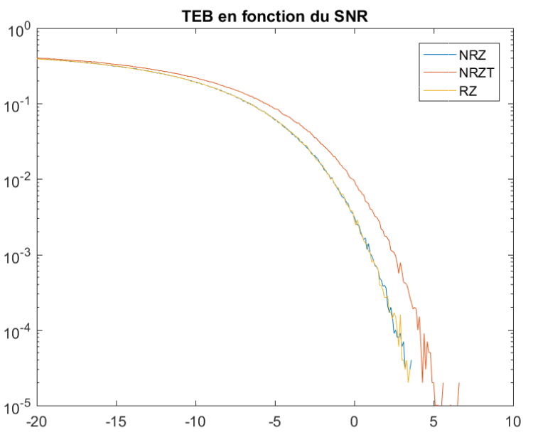
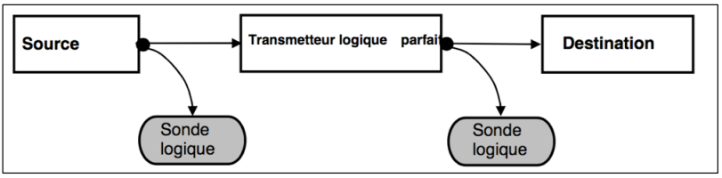
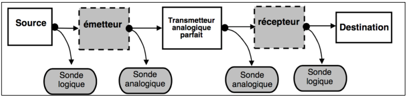
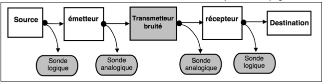
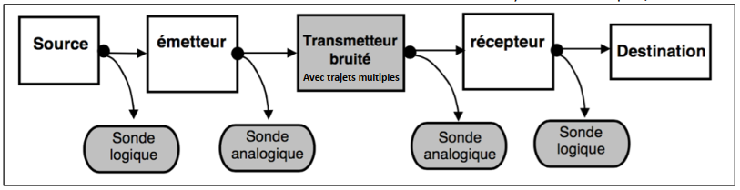
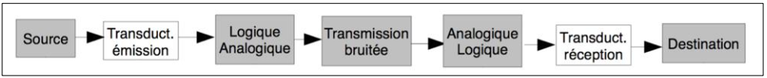
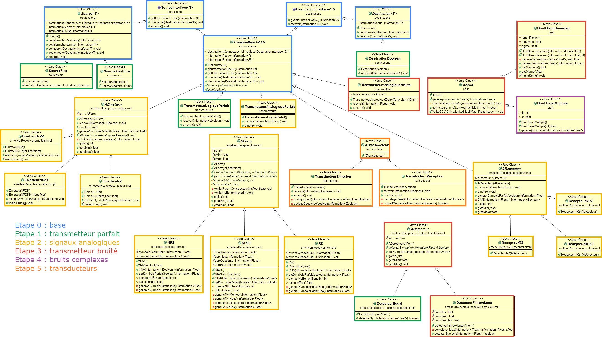

# Simulateur de système de transmissions
> Projet étudiant de développement Java

TELECOM Bretagne - Année 2016-2017

  
  

## Contexte
Dans le monde des télécommunications tel que nous le connaissons, des **signaux** sont émis
dans un environnement guidé (Fibre optique) ou libre (Faisceau hertzien). Ces signaux subissent
une atténuation et sont noyés dans divers types de **bruits**, ajoutés durant le trajet. Le signal en
réception peut ainsi être méconnaissable, et malgré les différents traitements mathématiques
existant à l’heure actuelle, il se peut qu’une partie ne soit plus exploitable. C’est ainsi que nos
récepteurs réalisent des erreurs de jugement, qui sont à l’origine de l’augmentation du **taux d’erreur
binaire (TEB)**.

L'objectif est de simuler le **taux d'erreur binaire** en fonction des **signaux** et des **bruits** appliqués avec un projet de 4 étudiants sur 1 mois. 

## Déroulement

Pour cela, les éléments modélisés sont : 
* Source : signal à émettre
* Codeur : ajoute de l'information redondante / passage en signal analogique
* Transmetteur : canal de transmission pouvant ajouter du bruit
* Décodeur : passage en signal numérique
* Destination : destinataire du signal d'origine

Le projet s'est déroulé en plusieurs étapes d'ajout de fonctionnalités.

**Etape 1** : signal numérique et transmetteur parfait  
Réalisation d'un simple transmetteur parfait (aucun bruit) avec un signal numérique :

**Etape 2** : signaux analogiques  
Ajout d'un codeur/décodeur pour transmettre 3 formes de signaux analogiques.

**Etape 3** : transmetteur bruité  
Ajout d'un bruit blanc gaussien via le transmetteur : le taux d'erreur binaire n'est plus à zéro

**Etape 4** : bruits complexes  
Ajout de bruits réalistes : trajets multiples, dispersion chromatique...

**Etape 5** : transducteur pour atténuer le bruit  
Ajout d'un tranducteur visant à atténuer les effets du bruits et diminuer le taux d'erreur binaire

## Méthode
Les tâches ont été réparties entre les membres de l'équipe :
* Florian Federico : intégrateur logiciel
* Bastien : chef de projet
* Nathan : coordinateur
* Thibaud : responsable des livrables

La conception et le développement ont été structurés afin de faciliter les modifications à chaque étape :
* Suivi de version : Git / BitBucket
* Tests de non-régression : mise en place de la méthode "Test Driven Development" avec les tests unitaires JUnit 
* Architecture modulaire : utilisation de designs pattern (Factory principalement pour les différentes formes de signaux)

Le diagramme UML a évolué avec les étapes du projet : 

## Résultats

Le logiciel final fourni au client est actuellement **opérationnel**, entièrement **documenté**
(Javadoc) et également **performant**. Nous avons conçu une application permettant de simuler un
système de télécommunications. À travers cette application, nous offrons au client l’opportunité
de choisir la valeur de l’échantillonnage, la valeur du SNR ou bien le nombre de trajets multiples. Il
s’agit donc d’une application complète qui peut aussi bien servir à simuler un système radio, tout
comme un système optique.

D’un point de vue logiciel, nous avons fait en sorte de le structurer d’une manière **très
organisée**, la plus **épurée** possible. Ainsi, il est **très facile, à terme, d’ajouter d’autres bruits ou
d’autres méthodes de codage canal / codage de forme**. Notre logiciel est ainsi facilement
**modulable**, ce qui est un plus à mettre en avant auprès du client.  
De même, il est peut-être intéressant de préciser que le logiciel fourni est extrêmement
performant. Nous avons essayé d’optimiser au maximum les ressources nécessaires au bon
fonctionnement de l’application. Cette dernière peut donc être facilement utilisée sur les
ordinateurs des clients.

L’**architecture** développée lors de ce projet, nous avons permis de **gagner du temps** en
anticipant l’ajout de plusieurs éléments (très facile d’implémenter les trajets multiples et les
transducteurs).

## Utilisation
### NAME
simulateur – Simulation de la transmission d'un message numérique.

### SYNOPSIS
java Simulateur [...]

### DESCRIPTION
Il s'agit de simuler la transmission d'un message numérique (train de bits 0 ou 1) dans un système de transmission
entre un point d’entrée jusqu'à un point de sortie, via un canal de transmission (ou de communication).  
Les nombreux paramètres de la simulation permettent de choisir les caractéristiques du message à transmettre, du
canal de propagation et du système de transmission.  
Le résultat de la simulation est la valeur du taux d’erreur binaire de la transmission totale (TEB).  
Les graphiques reproduisant le signal à différents étages du système de transmission (si option –s) sont assimilables
à des résultats.

### OPTIONS
Par défaut le simulateur utilise une chaîne de transmission logique, avec un message aléatoire de longueur 100, sans
utilisation de sondes et sans utilisation de transducteur.

 
* **-mess m** : précise le message ou la longueur du message à émettre.
  * Si **m** est une suite de 0 et de 1 de longueur au moins égale à 7, **m** est le message à émettre.
  * Si **m** comporte au plus 6 chiffres décimaux et correspond à la représentation en base 10 d'un entier, cet entier est la longueur du message que le simulateur doit générer et transmettre.
* **-s** : indique l’utilisation des sondes.
  * Par défaut le simulateur n’utilise pas de sondes
* **-seed v** : précise l’utilisation d’une semence pour l’initialisation des générateurs aléatoires du simulateur.
  * **v** doit être une valeur entière. L’utilisation d’une semence permet de rejouer à l’identique une simulation (à la fois pour le message émis et le bruitage s’il est activé).
  * Par défaut le simulateur n’utilise pas de semence pour initialiser ses générateurs aléatoires.
* **-form t** : utilisation d’une transmission analogique, **f** précise la forme d’onde.
  * Le paramètre **f** peut prendre les valeurs suivantes :
    * *NRZ* forme d'onde rectangulaire
    * *NRZT* forme d'onde trapézoïdale (temps de montée ou de descente à 1/3 du temps bit)
    * *RZ* forme d'onde impulsionnelle (amplitude min sur le premier et dernier tiers du temps bit, impulsionnelle sur le tiers central avec un max au milieu du temps bit égal à l’amplitude max)
  * Par défaut le simulateur utilise la forme d’onde *RZ* pour le signal analogique.
* **-nbEch ne** : utilisation d’une transmission analogique, **ne** précise le nombre d’échantillons par bit.
  * **ne** doit être une valeur entière positive.
  * Par défaut le simulateur utilise 30 échantillons par bit.
* **-ampl min max** : utilisation d’une transmission analogique, **min** et **max** précisent l’amplitude min et max du signal.
  * **min** et **max** doivent être des valeurs flottantes (avec **min** < **max**).
  * Par défaut le simulateur utilise 0.0f comme **min** et 1.0f comme **max**.
* **-snr s** : utilisation d’une transmission analogique bruitée, **s** est la valeur du rapport signal sur bruit (SNR en dB).
  * Le paramètre **s** doit être une valeur flottante.
* **-ti dt ar** : utilisation d’une transmission analogique multitrajet.
  * **dt** précise le décalage temporel (en nombre d’échantillons) entre le trajet indirect du signal et le trajet direct
  * **ar** précise l’amplitude relative du signal du trajet indirect par rapport à celle du signal du trajet direct
  * Les **dt** et **ar** doivent être une valeur entière et une valeur flottante.
  * Par défaut le simulateur doit utiliser 0 et 0.0f pour tous les trajets indirects (5 au maximum).
* **-transducteur** : précise l’utilisation d’un transducteur (en émission et réception).
  * Par défaut le simulateur n’utilise pas de transducteur.

## Configuration

1. Compilation des sources : compile.sh
2. Génération de la Javadoc : generateJavadoc.sh
3. Execution du programme : Simulateur.jar avec les paramètres voulus
4. Execution des tests: test.sh

## Licence

Ce projet est sous licence GPL v3.

