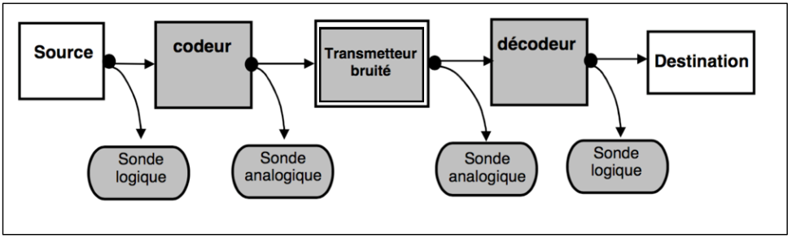

# Simulateur de système de transmissions
> Projet étudiant de développement Java

TELECOM Bretagne - Annee 2016-2017

Dans le monde des télécommunications tel que nous le connaissons, des **signaux** sont émis
dans un environnement guidé (Fibre optique) ou libre (Faisceau hertzien). Ces signaux subissent
une atténuation et sont noyés dans divers types de **bruits**, ajoutés durant le trajet. Le signal en
réception peut ainsi être méconnaissable, et malgré les différents traitements mathématiques
existant à l’heure actuelle, il se peut qu’une partie ne soit plus exploitable. C’est ainsi que nos
récepteurs réalisent des erreurs de jugement, qui sont à l’origine de l’augmentation du **taux d’erreur
binaire (TEB)**.

Ce projet de simulation en Java a eu pour objectif de simuler le **taux d'erreur binaire** en fonction des **signaux** et des **bruits** appliqués. 
Pour cela, les éléments modélisés sont : 
* Source : signal à émettre
* Codeur : ajoute de l'information redondante / passage en signal analogique
* Transmetteur : canal de transmission pouvant ajouter du bruit
* Décodeur : passage en signal numérique
* Destination : destinataire du signal d'origine

  

## Fonctionnalités

  

## Outils utilisés
Programmation
* Suivi de version : Git / BitBucket
* Tests unitaires : JUnit
* Designs pattern : Factory...

## Contributeurs

* Florian Federico : intégrateur
* Bastien : chef de projet
* Nathan : coordinateur
* Thibaud : responsable des livrables

## Configuration

1. Compilation des sources : compile.sh
2. Génération de la Javadoc : generateJavadoc.sh
3. Execution du programme : Simulateur.jar avec les paramètres voulus
4. Execution des tests: test.sh

## Licence

Ce projet est sous licence GPL v3.

